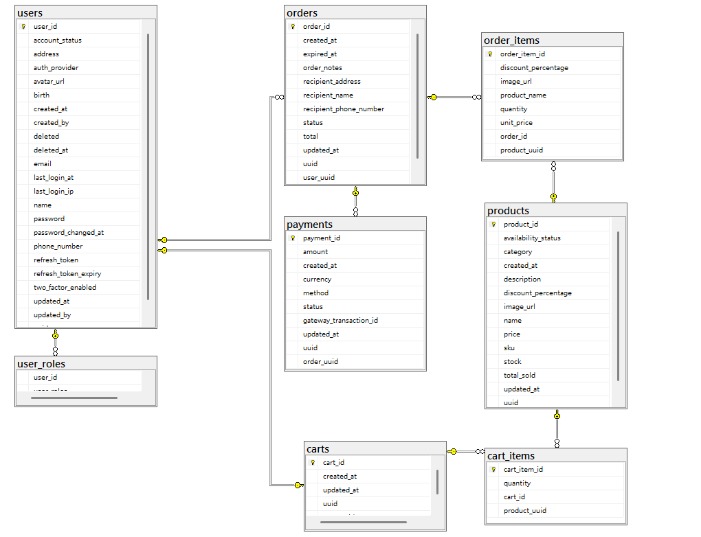
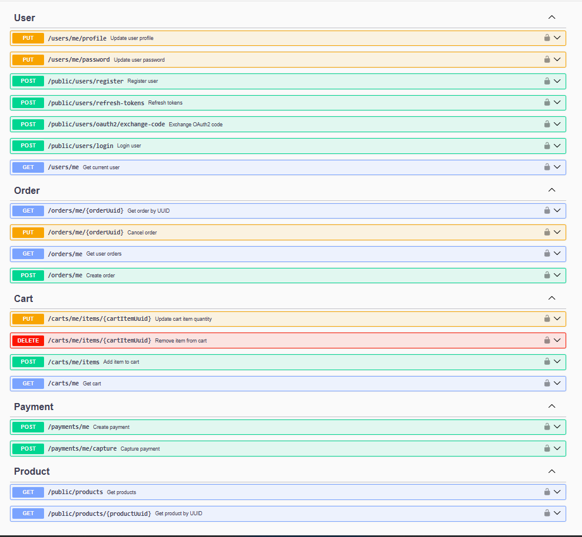

# Online Shop - Backend

This is a e-commerce backend built with Spring Boot 3.3.0, providing user management, product catalog, shopping cart, order processing, and payment functionality.

## Technology Stack

- **Framework**: Spring Boot 3.3.0
- **Java**: JDK 17
- **Database**: Microsoft SQL Server
- **Session Store**: Redis
- **Security**: Spring Security + JWT + OAuth2 (Google)
- **Mapping**: MapStruct 1.5.5.Final
- **Payment**: PayPal SDK 1.14.0
- **Build**: Maven 3.9.6
- **Containerization**: Docker + Tomcat 10.1.46

## Database Schema



## API Documentation

The interactive API documentation is available via Swagger UI. You can explore and test the endpoints directly from your browser:
[Swagger UI - Online Shop](https://shuyahsieh.xyz/onlineShop/swagger-ui/index.html)



## Getting Start

### Prerequisites

- JDK 17+ (required)
- Maven 3.9.6+ (optional, or use the included Maven Wrapper)
- MS SQL Server (optional, or use Docker)
- Redis (optional, or use Docker)

### Installation

1. **Clone the Repository**

   ```bash
   git clone https://github.com/shu-ya318/online-shop-backend.git
   cd online-shop-backend
   ```

2. **Configure Environment Variables**
   
   The main configuration file is `src/main/resources/application.properties`. By default, it uses the `local` profile (`spring.profiles.active=local`).
   
   For local development, you can create an `application-local.properties` file in the same directory to override default settings (e.g., database credentials, JWT secret).
   
   For Docker deployment, create an `application-docker.properties` file.

### Development

Start the development server:

**Windows (CMD/PowerShell):**

```bash
cd demo
.\mvnw.cmd spring-boot:run
```

**Unix/Linux/macOS:**

```bash
cd demo
./mvnw spring-boot:run
```

> **Note:** The application will be available at `http://localhost:8080/onlineShop/` (or the port and context path configured in your properties files).

### Deployment

1. **Build for Production**

    **Windows:**

    ```bash
    cd demo
    .\mvnw.cmd clean package
    cd ..
    ```

    **Unix/Linux/macOS:**

    ```bash
    cd demo
    ./mvnw clean package
    cd ..
    ```

    > **Note:** The built WAR file will be output to the `demo/target/` directory as `onlineShop.war`.

2. **Deploy to Local with Tomcat**

    After building the project, you can deploy the WAR file to your local Tomcat server:

    **Windows:**
    ```bash
    copy demo\target\onlineShop.war C:\path\to\your\tomcat\webapps\onlineShop.war
    
    C:\path\to\your\tomcat\bin\catalina.bat run
    ```

    **Unix/Linux/macOS:**
    ```bash
    cp demo/target/onlineShop.war /path/to/your/tomcat/webapps/onlineShop.war

    /path/to/your/tomcat/bin/catalina.sh run
    ```

    The application will be accessible at `http://localhost:8080/onlineShop/`

    > **Note:** You can rename `onlineShop.war` to a different name if you want to change the application context path (e.g., `myapp.war` will be accessible at `http://localhost:8080/myapp/`).
    
    > **Prerequisites:** Make sure you have Apache Tomcat 10.x installed and configured with JDK 17+.

3. **Containerization (Docker)**

    This project can also be deployed using Docker Compose from the parent directory. Please refer to the `docker-compose.yml` file in the parent directory for containerized deployment instructions.

    For standalone Docker deployment:

    ```bash
    # Build Docker image (multi-stage build)
    docker build -t online-shop-backend:latest .
    
    # Run container with host.docker.internal (for local testing)
    docker run -d -p 8080:8080 \
      --name online-shop-backend \
      -e SA_PASSWORD=YourStrong@Passw0rd \
      -e REDIS_PASSWORD=YourRedisPassword \
      -e SPRING_DATASOURCE_URL=jdbc:sqlserver://host.docker.internal:1433;databaseName=onlineShopDB;encrypt=true;trustServerCertificate=true; \
      -e SPRING_DATA_REDIS_HOST=host.docker.internal \
      online-shop-backend:latest
    ```

    The application will be accessible at `http://localhost:8080/onlineShop/`

    > **Note:** 
    > - **Custom Context Path**: All environments (local, Docker, Tomcat) are configured to use the `/onlineShop` context path. The application will always be accessible at `http://localhost:8080/onlineShop/`.
    > - The container uses `SPRING_PROFILES_ACTIVE=docker` by default (set in Dockerfile).
    > - You must provide `SA_PASSWORD` and `REDIS_PASSWORD` environment variables.
    > - The above command assumes SQL Server and Redis are running on your host machine (accessible via `host.docker.internal`).
    > - **For multi-container deployment**: If you want to run this container together with `database` and `cache` containers in the same Docker network, you need to:
    >   - Create a Docker network: `docker network create online-shop-network`
    >   - Add `--network online-shop-network` to all container run commands
    >   - Remove the `SPRING_DATASOURCE_URL` and `SPRING_DATA_REDIS_HOST` overrides (it will use default `database:1433` and `cache:6379`)
    > - You can change the port mapping (e.g., `-p 9090:8080`) to expose the application on a different host port.

## Project Structure

```
online-shop-backend/
├── .gitignore
├── Dockerfile
├── README.md
├── apache-tomcat-10.1.46.tar.gz
└── demo/
    ├── .mvn/
    ├── src/
    │   ├── main/
    │   │   ├── java/com/project/demo/
    │   │   │   ├── config/
    │   │   │   ├── controller/
    │   │   │   ├── converter/
    │   │   │   ├── data/
    │   │   │   ├── dto/
    │   │   │   ├── enumeration/
    │   │   │   ├── exception/
    │   │   │   ├── gateway/
    │   │   │   ├── mapper/
    │   │   │   ├── model/
    │   │   │   ├── repository/
    │   │   │   ├── security/
    │   │   │   ├── service/
    │   │   │   ├── specification/
    │   │   │   └── DemoApplication.java
    │   │   └── resources/
    │   │       ├── application-docker.properties
    │   │       ├── application-local.properties
    │   │       ├── application.properties
    │   └── test/
    ├── mvnw
    ├── mvnw.cmd
    └── pom.xml
```

## Configuration

### Database Configuration

- Uses Microsoft SQL Server as the primary database
- Supports automatic table structure updates
- Connection pool configuration supports encrypted connections

### Security Configuration

- JWT token authentication
- Google OAuth2 integration
- Role-based access control
- CORS cross-origin support

### Redis Configuration

- Used as a **Session Store** for session management
- Supports password protection for secure access

### Payment Configuration

- PayPal payment gateway integration
- Supports both sandbox and production environments
